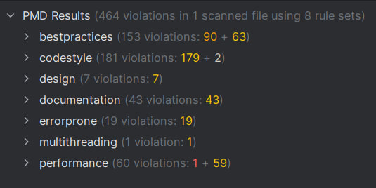
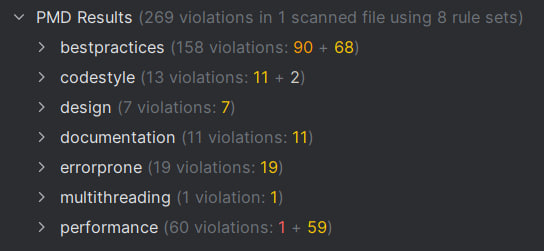

# Remove Code Style Violations Using PMD

## This document shows Before and After examples of removing code style violations using PMD.

## 🚫 Before (PMD Scan Results)

Before PMD Fixes

## ✅ After (PMD Scan Results)

After PMD Fixes

## This demonstrates how PMD identifies style issues and how the corrected version improves readability and consistency.