# Software Engineering Methods

## Git Workflow

A Git workflow is a defined process that guides how developers collaborate, manage code changes, and release stable
versions of software.

## License

[Apache-2.0](https://www.apache.org/licenses/LICENSE-2.0)

# Requirements Checklist

## Country Reports

| ID | Requirement                                                                   | Met | Screenshot                   |
|----|-------------------------------------------------------------------------------|-----|------------------------------|
| 1  | All the countries in the world organised by largest population to smallest.   | Yes |  |
| 2  | All the countries in a continent organised by largest population to smallest. | Yes |  |
| 3  | All the countries in a region organised by largest population to smallest.    | Yes | 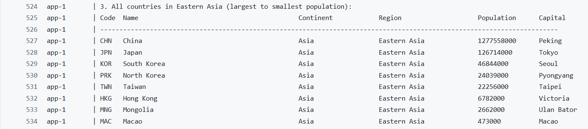 |
| 4  | The top N populated countries in the world where N is provided by the user.   | Yes | 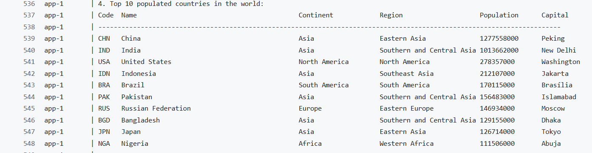 |
| 5  | The top N populated countries in a continent where N is provided by the user. | Yes | 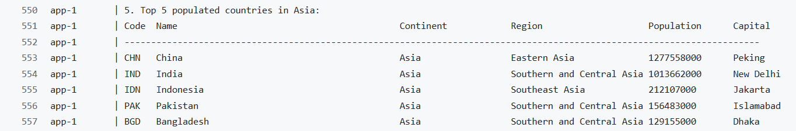 |
| 6  | The top N populated countries in a region where N is provided by the user.    | Yes |  |

## City Reports

| ID | Requirement                                                                | Met | Screenshot                     |
|----|----------------------------------------------------------------------------|-----|--------------------------------|
| 7  | All the cities in the world organised by largest population to smallest.   | Yes |    |
| 8  | All the cities in a continent organised by largest population to smallest. | Yes | 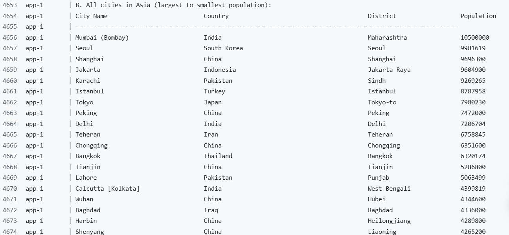   |
| 9  | All the cities in a region organised by largest population to smallest.    | Yes |    |
| 10 | All the cities in a country organised by largest population to smallest.   | Yes | 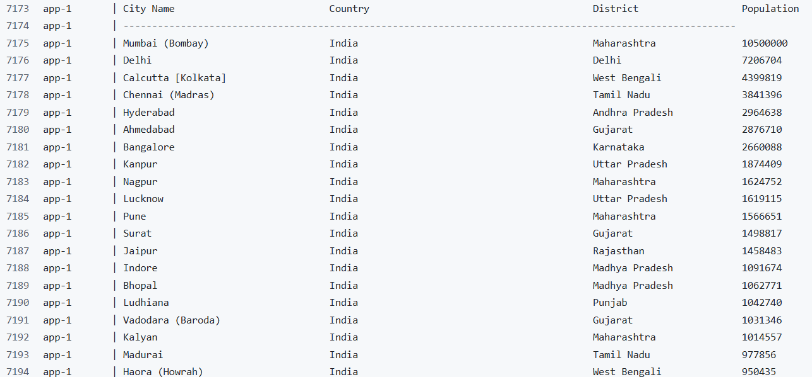 |
| 11 | All the cities in a district organised by largest population to smallest.  | Yes |  |
| 12 | The top N populated cities in the world where N is provided by the user.   | Yes | 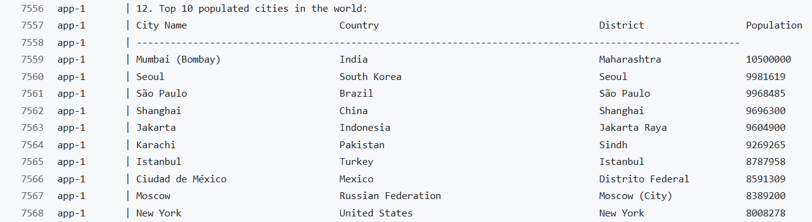 |
| 13 | The top N populated cities in a continent where N is provided by the user. | Yes |  |
| 14 | The top N populated cities in a region where N is provided by the user.    | Yes | 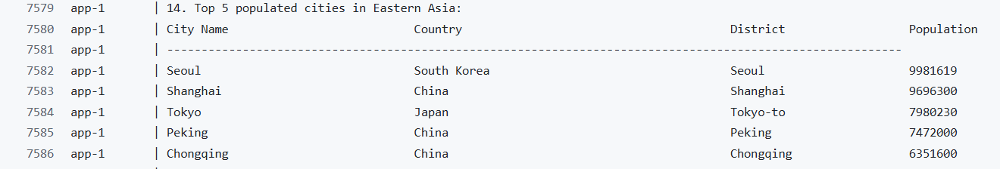 |
| 15 | The top N populated cities in a country where N is provided by the user.   | Yes |  |
| 16 | The top N populated cities in a district where N is provided by the user.  | Yes | 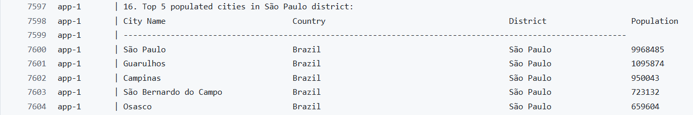 |

## Capital City Reports

| ID | Requirement                                                                        | Met | Screenshot                     |
|----|------------------------------------------------------------------------------------|-----|--------------------------------|
| 17 | All the capital cities in the world organised by largest population to smallest.   | Yes | 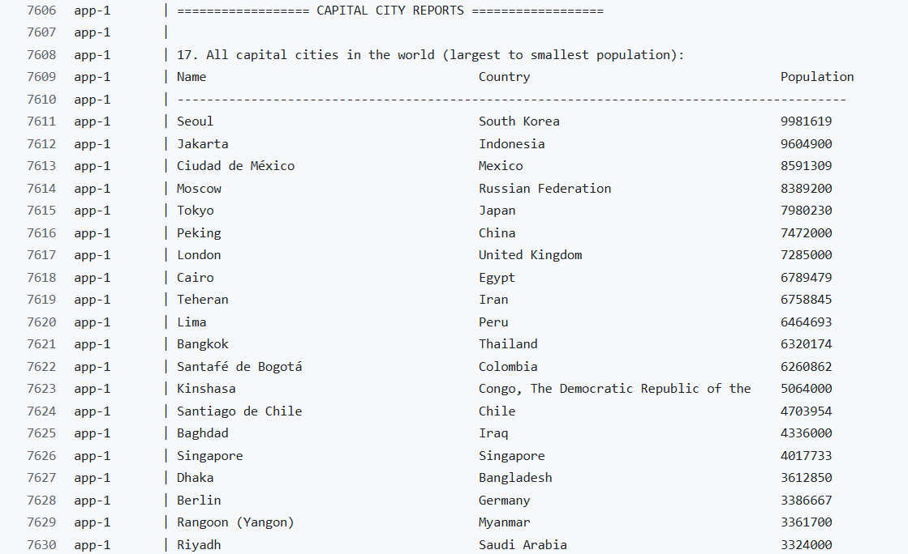 |
| 18 | All the capital cities in a continent organised by largest population to smallest. | Yes | 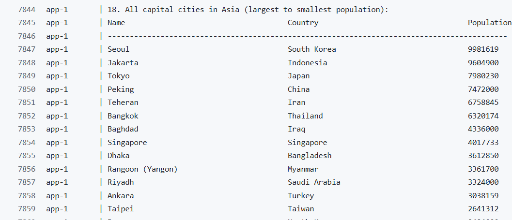 |
| 19 | All the capital cities in a region organised by largest to smallest.               | Yes | 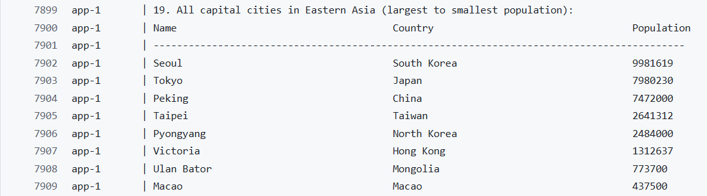 |
| 20 | The top N populated capital cities in the world where N is provided by the user.   | Yes |  |
| 21 | The top N populated capital cities in a continent where N is provided by the user. | Yes | 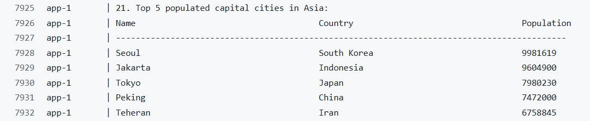 |
| 22 | The top N populated capital cities in a region where N is provided by the user.    | Yes | 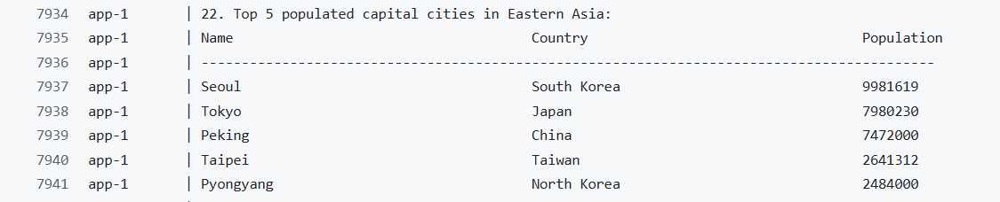 |

## Population Reports

| ID | Requirement                                                                                           | Met | Screenshot                     |
|----|-------------------------------------------------------------------------------------------------------|-----|--------------------------------|
| 23 | The population of people, people living in cities, and people not living in cities in each continent. | Yes |  |
| 24 | The population of people, people living in cities, and people not living in cities in each region.    | Yes | 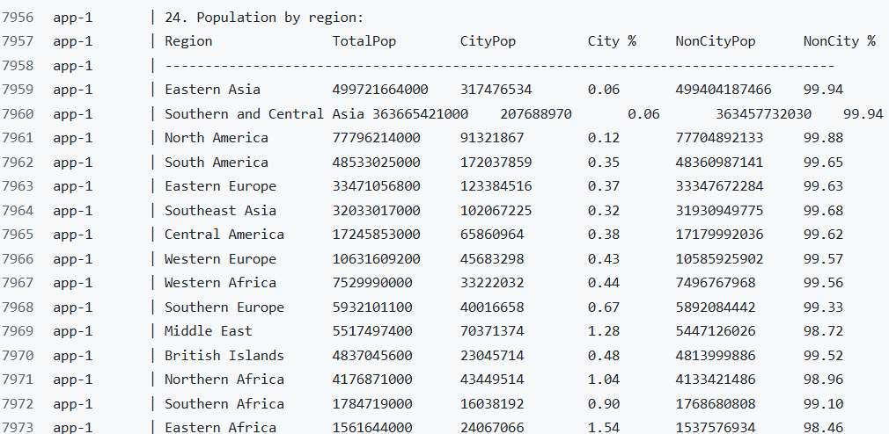 |
| 25 | The population of people, people living in cities, and people not living in cities in each country.   | Yes | 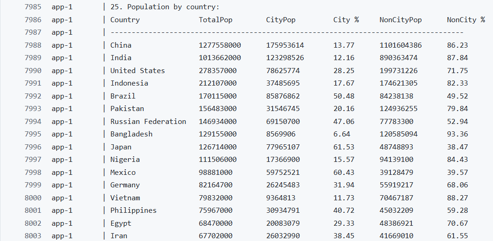 |
| 26 | The population of the world.                                                                          | Yes |  | 
| 27 | The population of a continent.                                                                        | Yes |  |
| 28 | The population of a region.                                                                           | Yes |  |
| 29 | The population of a country.                                                                          | Yes |  |
| 30 | The population of a district.                                                                         | Yes |  |
| 31 | The population of a city.                                                                             | Yes |  |

## Language Report

| ID | Requirement                                                                                                                                                 | Met | Screenshot                     |
|----|-------------------------------------------------------------------------------------------------------------------------------------------------------------|-----|--------------------------------|
| 32 | The number of people who speak Chinese, English, Hindi, Spanish, Arabic from greatest number to smallest, including the percentage of the world population. | Yes |  |

